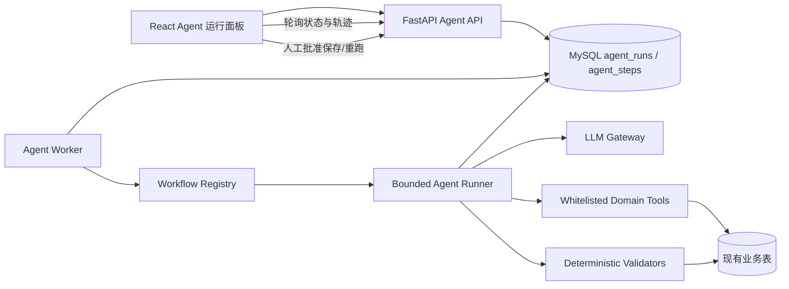

# TestMind AI 用例生成与失败根因分析 Agent 化技术方案

> 版本：v1.0
>
> 日期：2026-09-01
>
> 范围：需求文本生成用例、接口文档生成用例、单接口/场景执行失败根因分析
>
> 本文只给出技术方案，不包含代码实现。

## 1. 结论

升级可行，而且不需要重写 TestMind。

当前项目已经具备 Agent 化所需的主要业务地基：项目与模块权限、需求和接口文档、接口/功能用例、模型配置中心、pytest 执行记录、场景步骤实际请求与响应、生成结果预览和人工勾选保存。缺少的主要是统一 Agent Runtime、领域工具、运行状态、证据追踪、结构化输出、有限反馈循环和评测体系。

推荐的目标不是开放式“全自动自主 Agent”，而是：

> **单 Agent + 代码定义的有限状态图 + 白名单领域工具 + 最多两轮修复 + 全程可观测 + 高风险动作人工审批。**

第一版不建议引入多 Agent、向量数据库、任意 SQL/Shell/文件工具，也不建议让 Agent 自动保存用例或自动重放有副作用的接口。Agent 能力应体现在“根据目标选择所需证据和工具、验证结果、发现缺口后定向修复”，而不是单纯把一次 LLM 调用改成多次调用。

## 2. 当前实现审计

### 2.1 AI 用例生成

项目实际存在两条 LLM 用例生成链路。

#### 需求文本 → 功能测试用例

当前流程：

```text
RequirementPage
  → POST /function-cases/generate-from-requirement
  → 查询 RequirementDoc
  → 拼接 Prompt
  → 单次 call_llm_with_model
  → JSON 修复/字段校验
  → 前端预览
  → 用户勾选后保存
```

证据位置：

- Prompt：`backend/app/services/function_case_generation_service.py:22-46`
- 模型选择与单次调用：`backend/app/services/function_case_generation_service.py:164-206`
- 解析和基础校验：`backend/app/services/function_case_generation_service.py:206-248`
- 人工确认后保存：`backend/app/services/function_case_generation_service.py:262-315`
- 前端生成、预览、勾选：`frontend/src/pages/RequirementPage.jsx:276-332,648-745`

#### 接口文档 → 接口测试用例

当前流程与上面相同，也是单次生成、解析、预览、人工保存：

- Prompt：`backend/app/services/api_document_generation_service.py:29-79`
- 单次调用：`backend/app/services/api_document_generation_service.py:252-279`
- JSON 修复和字段规范化：`backend/app/services/api_document_generation_service.py:82-249`
- 保存：`backend/app/services/api_document_generation_service.py:307-345`
- 前端入口：`frontend/src/pages/ApiDocPage.jsx:240-299`

两条链路目前都没有需求拆解、历史用例检索、覆盖计划、工具选择、覆盖度审查、定向修复、运行状态和调用轨迹，因此本质上是“一次 Prompt + 一次 LLM API”。

需要特别澄清：`backend/app/services/ai_service.py:663-679` 当前已经把接口 pytest 代码生成统一为确定性规则生成，不是 LLM 调用。该文件中的上下文规范化、断言计划、代码生成和规则校验反而可以复用为 Agent 的本地校验工具。

### 2.2 AI 测试失败根因分析

当前流程：

```text
TestRun + 当前 APICase + 当前 generated_test_code
  → 拼成一个长 Prompt
  → 单次同步 httpx.post
  → 返回自由文本
  → 正则提取 risk_level
  → AIAnalysis.content 落库
```

证据位置：

- 上下文和 Prompt：`backend/app/services/analysis_service.py:13-116`
- 单次 LLM 调用：`backend/app/services/analysis_service.py:119-161`
- 风险等级文本正则：`backend/app/services/analysis_service.py:164-185`
- 文本结果落库：`backend/app/services/analysis_service.py:188-235`
- 数据模型：`backend/app/models/ai_analysis.py:7-15`

当前实现有以下关键缺口：

1. 分析旧运行时读取的是“当前用例和当前代码”，不是运行当时的冻结快照；用例修改后可能误判旧失败。
2. `TestRun` 没有保存实际请求快照、代码哈希、环境摘要、子进程退出码、执行器版本和耗时。
3. 自由文本经过后端和前端正则二次解析，格式稳定性较弱。
4. 完整 headers、body、日志和响应可能未经脱敏直接发给模型。
5. 日志、响应、需求和补充提示词都是不可信输入，拥有工具后会形成 Prompt Injection 风险。
6. 模型配置中心已经有 `failure_analysis` 场景，但 `analysis_service.py` 仍直接读取 `.env` 并自己调用 HTTP，没有复用统一客户端。
7. 真实场景执行的 `SceneStepRun` 已经保存实际请求、响应、断言、变量提取和耗时（`backend/app/models/scene_step_run.py:17-26`），当前 AI 分析完全没有利用这些证据。
8. 每次点击 POST 都会新调用模型并新增记录，没有幂等、缓存、任务状态、模型版本、token、延迟和成本信息。

### 2.3 已有基础设施与需要先处理的问题

可直接复用：

- `LLMProvider`、`LLMModel`、`LLMSceneConfig`
- 项目级读写权限校验
- `APICase`、`FunctionCase`、`RequirementDoc`、`ApiDocument`
- `TestRun`、`SceneRun`、`SceneStepRun`
- 用例生成预览和人工选择保存
- `ai_service.py` 的输入规范化、断言计划与代码规则校验

需要先处理：

- 当前默认数据库是 MySQL，见 `backend/app/core/config.py:7`；部分旧文档仍写 SQLite，实施时以源码和实际环境为准。
- 当前通过 `Base.metadata.create_all()` 建表，见 `backend/app/main.py:49-50`。它不能可靠地修改已有表，Agent 表和兼容字段上线前必须引入 Alembic。
- `call_llm_by_scene()` 捕获过宽的 `ValueError`，配置错误、输出错误和供应商调用错误可能被混为一类并错误回退 `.env`。
- 当前后端没有独立的业务单元/集成测试目录，`tests_generated` 是运行产物，不是平台回归测试。
- 功能用例请求中的 `generate_count` 当前没有真正约束生成数量。
- 接口文档已有结构化 headers/params/body/response 字段，但当前生成 Prompt 没有充分利用。

## 3. Agent 能力定义与边界

### 3.1 本项目中“Agent”的最低定义

一个运行实例至少要具备：

1. 明确目标和成功条件。
2. 可持久化的运行状态。
3. 一组有明确输入、输出、权限和副作用说明的领域工具。
4. 根据当前证据决定下一步，而不是固定只调用一次模型。
5. 对工具结果进行观察、验证和必要的有限修复。
6. 最大步数、最大模型调用、超时、token 预算和停止条件。
7. 可查询的步骤轨迹、模型版本、Prompt 版本、耗时和错误。
8. 对保存、重跑等写操作设置人工确认。

不保存模型隐藏思维链，只保存可观察的工具调用、脱敏输入/输出摘要、校验结果和最终决策说明。

### 3.2 第一版明确不做

- 多 Agent 协作、Agent swarm 或角色互相聊天
- 长期跨任务记忆
- 向量数据库和完整 RAG 平台
- 任意 SQL、Shell、文件系统、网页访问工具
- Agent 自动保存全部用例
- Agent 自动运行生成代码
- 未经批准重放 POST/PUT/PATCH/DELETE
- 无限反思、无限重试
- 微服务或 Kubernetes 拆分

## 4. 总体架构



建议在现有 FastAPI 单体内增加 Agent 平台层，不拆服务。第一版使用一个独立单 Worker 轮询 MySQL 中的 `queued` 任务，原子抢占后执行并写 heartbeat。这样比 FastAPI `BackgroundTasks` 更容易处理进程重启和长任务，又暂时不需要 Redis/Celery。

当实际并发或可靠重试需求出现后，再把 `AgentJobDispatcher` 接口替换成 Redis + RQ/Celery/ARQ。前端第一版每 1–2 秒轮询，不必立即引入 WebSocket/SSE。

## 5. 公共 Agent Runtime

### 5.1 核心组件

#### `LLMGateway`

- 复用现有 Provider/Model/Scene 配置。
- 支持 system/user/tool 多消息，而不是只有一个 user message。
- 支持结构化输出 Schema；供应商不支持原生 JSON Schema 时，退化为 JSON 契约 + Pydantic 校验 + 一次修复。
- 支持模型能力标记：`supports_tools`、`supports_json_schema`、`context_window`。
- 统一超时、429/5xx 有界重试、错误分类和熔断。
- 返回 `content/provider/model/usage/latency_ms/request_id/finish_reason`。
- 保留当前字符串调用包装器，保证旧链路可回滚。

错误至少区分：

- `LLMConfigurationError`
- `LLMTimeoutError`
- `LLMProviderError`
- `LLMOutputValidationError`
- `AgentBudgetExceededError`

#### `AgentRunner`

- 读取 workflow 定义并推进状态。
- 每个步骤单独创建短事务，不跨 LLM 请求长期持有 SQLAlchemy Session。
- 支持 queued/running/waiting_approval/succeeded/failed/cancelled/interrupted。
- 检查取消标记、heartbeat、总超时、最大步数、最大工具调用和模型调用预算。
- 失败时记录可重试性；非幂等步骤不自动重试。

#### `WorkflowRegistry`

第一版只注册代码中固定且有版本号的两个工作流：

- `case_generation_v1`
- `failure_rca_v1`

暂不允许管理员在线拼装任意 Agent 流程。Prompt 也应按工作流和节点版本化，例如 `failure_rca/hypothesis/v1`。

#### `ToolRegistry`

每个工具必须声明：

- 工具名与用途
- Pydantic 输入/输出 Schema
- read/write 属性
- 所需项目权限
- 是否幂等
- 是否需要人工批准
- 最大返回行数/字节数
- 超时与错误类型

LLM 不能直接持有数据库 Session，也不能获得通用 SQL、任意 URL 或任意代码执行能力。工具包装器在每一次调用时重新校验 `requester_user_id + project_id`，不能只在创建任务时鉴权。

#### `Guardrails / Validators`

- 输入长度治理和上下文切片
- Authorization、Cookie、token、password、secret、API Key 等敏感信息脱敏
- 文档/日志/响应按“不可信证据”处理
- Pydantic/JSON Schema 校验
- 用例重复和覆盖度校验
- 证据引用可解析性校验
- 写操作审批和目标环境白名单

### 5.2 结构化状态

通用状态示例：

```json
{
  "run_id": 101,
  "workflow_code": "failure_rca_v1",
  "goal": "定位 test_run 123 的主要根因",
  "current_step": "verify_hypotheses",
  "facts": {},
  "artifacts": {},
  "validation_errors": [],
  "steps_used": 4,
  "llm_calls_used": 1,
  "tool_calls_used": 3,
  "deadline_at": "..."
}
```

状态中保存业务事实和可观察证据，不保存隐藏思维链。

## 6. 用例生成 Agent

### 6.1 状态图

```text
INIT
  → LOAD_CONTEXT
  → DECOMPOSE_SOURCE
  → PLAN_COVERAGE
  → GENERATE_CANDIDATES
  → LOCAL_VALIDATE
  → REVIEW_COVERAGE
  → REPAIR_GAPS（最多 2 轮）
  → WAITING_APPROVAL
  → SAVE_SELECTED / CANCELLED
```

LLM 只负责来源拆解、覆盖计划、候选生成、覆盖审查和缺口修补。本地工具负责数据库读取、Schema、枚举、URL/方法一致性、去重、覆盖矩阵和可执行性检查。

### 6.2 两类来源的统一抽象

统一输入：

```json
{
  "source_type": "requirement | api_document",
  "source_id": 1,
  "case_types": ["正常场景", "异常场景", "边界场景", "业务规则场景"],
  "max_cases": 30,
  "user_goal": "可选的补充目标"
}
```

统一中间产物：

- `atomic_clauses[]`：原子需求/接口约束及稳定 clause_id
- `assumptions[]`：文档未明确、禁止静默当作事实的假设
- `coverage_plan[]`：条款 × 测试维度
- `candidates[]`：候选用例及其覆盖的 clause_id
- `coverage_matrix`：覆盖、缺口和重复信息
- `warnings[]`：文档矛盾、无法验证的参数、缺少预期结果等

### 6.3 白名单工具

- `load_source_context`
- `load_project_module_context`
- `list_existing_cases`
- `list_related_api_documents`
- `validate_case_schema`
- `validate_case_business_rules`
- `deduplicate_cases`
- `compute_coverage_matrix`
- `dry_run_api_case_codegen`

`dry_run_api_case_codegen` 复用 `ai_service.py` 的规范化、断言计划和代码规则校验，仅在内存中验证能否生成合法 pytest，不落库、不写文件、不发真实请求。

### 6.4 关键规则

1. 先读取同需求、同文档或同模块已有用例，再生成候选。
2. API 用例的 method、URL、参数、鉴权要求必须能追踪到接口文档；无法追踪的内容进入 `assumptions`。
3. 覆盖率由确定性 coverage matrix 计算，不能只相信 Critic 模型自评。
4. 修复只接收未覆盖条款和非法候选，禁止每轮全量重生成。
5. 最大模型调用建议 4 次，最大修复轮次 2 次，达到覆盖目标即停止。
6. 结果仍先预览；只有用户勾选后才能调用保存工具。
7. 保存时再次校验来源对象、项目权限、候选哈希和运行状态，防止前端篡改。

## 7. 失败根因分析 Agent

### 7.1 实施前置：冻结执行证据

根因 Agent 的准确性首先取决于证据，而不是 Prompt。需要给单用例运行补充：

- 用例定义快照及 SHA-256
- 实际执行代码快照及 code hash
- 参数替换后的实际请求摘要
- Python、pytest、执行器版本和必要依赖摘要
- 子进程退出码、超时标记、duration_ms
- parser_version

所有模型出站数据使用脱敏副本；原始证据按现有业务权限保留在平台内部。

场景执行可直接复用 `SceneStepRun` 中已有的实际请求、响应、断言、变量提取和耗时，并补充上游步骤关系。

### 7.2 状态图

```text
INIT
  → AUTHORIZE_AND_FREEZE_CONTEXT
  → REDACT_ARTIFACTS
  → DETERMINISTIC_PRE_DIAGNOSIS
  → BUILD_HYPOTHESES
  → SELECT_READ_ONLY_TOOLS
  → VERIFY_EVIDENCE
  → FETCH_ONE_MORE_EVIDENCE_ROUND（可选，最多 1 轮）
  → SYNTHESIZE_STRUCTURED_RESULT
  → CONFIDENCE_GATE
  → DONE / INCONCLUSIVE
```

Agent 必须允许输出 `inconclusive`。证据不足时不再强制从六类中猜一个根因。

### 7.3 默认只读工具

- `load_run_snapshot`
- `load_case_definition`
- `parse_pytest_failure`
- `audit_generated_code`
- `compare_case_history`
- `load_scene_trace`
- `lookup_api_contract`
- `check_environment_evidence`
- `redact_artifact`

其中：

- `parse_pytest_failure` 结构化提取异常类型、文件/行号、expected/actual、traceback 和 pytest node。
- `audit_generated_code` 使用 AST/compile 和现有 `ai_service.py` 规则检查请求构造与断言问题，不执行代码。
- `compare_case_history` 对比最近运行的状态码、响应签名、失败类型、code hash 和耗时，用于识别稳定回归、偶发失败和环境波动。
- `load_scene_trace` 加载失败步骤及其上游步骤、变量替换、提取结果和断言明细。

### 7.4 受控主动工具

以下工具不进入第一版默认能力：

- `rerun_case_once`
- `replay_scene_step`
- `safe_connectivity_probe`

后续开放时必须同时满足：人工二次确认、测试环境域名白名单、HTTP 方法白名单、幂等键、次数限制、超时和完整审计。POST/PUT/PATCH/DELETE、生产域名、任意 pytest 文件都不得由 Agent 自动执行。

### 7.5 输出合同

```json
{
  "target": {"type": "test_run", "id": 123},
  "diagnosis_status": "confirmed | likely | inconclusive",
  "primary_cause": {
    "category": "assertion",
    "subtype": "brittle_exact_match",
    "summary": "...",
    "confidence": 0.88
  },
  "hypotheses": [],
  "evidence": [
    {
      "evidence_id": "ev-3",
      "source_type": "test_run",
      "source_id": 123,
      "path": "parsed_failure.actual",
      "excerpt": "...",
      "supports": true
    }
  ],
  "recommendations": [],
  "missing_evidence": [],
  "risk_level": "low | medium | high"
}
```

`risk_level` 表示影响严重程度，`confidence` 表示诊断可信度，两者不能混用。主分类可兼容当前六类，同时增加稳定的细分类编码，例如：

- `INPUT.AUTH_EXPIRED`
- `GENERATED.REQUEST_BODY_MODE`
- `ASSERTION.BRITTLE_VALUE`
- `SUT.HTTP_5XX`
- `ENV.DNS_TIMEOUT`
- `CHAIN.VARIABLE_NOT_EXTRACTED`

每个事实性结论必须绑定证据 ID。最终结果为 `TestRun` 时，可同时渲染一份兼容旧页面的中文 `content` 并写入 `ai_analyses`。

## 8. 数据模型

### 8.1 `agent_runs`

建议字段：

- `id`
- `workflow_code`、`workflow_version`
- `project_id`、`requester_user_id`
- `source_type`、`source_id`
- `status`、`current_step`
- `input_json`、`output_json`
- `input_hash`、`idempotency_key`
- `model_snapshot_json`、`prompt_version`
- `max_steps`、`steps_used`
- `llm_calls_used`、`tool_calls_used`
- `prompt_tokens`、`completion_tokens`
- `error_code`、`error_message`
- `worker_id`、`heartbeat_at`
- `started_at`、`finished_at`、`created_at`、`updated_at`

唯一活跃任务约束应至少覆盖：`workflow_code + source_type + source_id + input_hash + prompt_version`。

### 8.2 `agent_steps`

建议字段：

- `id`、`agent_run_id`、`sequence_no`
- `step_kind`: llm/tool/validation/approval
- `step_name`、`tool_name`、`status`
- `input_json`、`output_json`（只能存脱敏内容或摘要）
- `provider_name`、`model_name`
- `prompt_tokens`、`completion_tokens`
- `duration_ms`、`error_code`、`error_message`
- `started_at`、`finished_at`

这张表同时承担最小可观测轨迹；第一版不需要完整事件溯源系统。

### 8.3 `agent_feedback`

- `id`、`agent_run_id`、`user_id`
- `rating`、`is_correct`
- `corrected_category`
- `comment`、`created_at`

### 8.4 现有表兼容字段

- `api_cases.generation_agent_run_id`（nullable）
- `function_cases.generation_agent_run_id`（nullable）
- `ai_analyses.agent_run_id`、`root_cause_category`、`confidence`、`evidence_json`、`suggestions_json`（均 nullable）
- `test_runs` 增加运行快照、code hash、exit code、duration、parser/runner version 等字段，或用独立 artifact 表保存大对象

候选用例第一版可以携带稳定 `candidate_id` 存在 `agent_runs.output_json` 中；只有出现大对象、频繁局部修订或独立查询需求后，再增加 `agent_artifacts/generated_case_candidates` 表。

## 9. API 与前端交互

### 9.1 通用 API

- `POST /agent-runs`：创建任务，返回 `202 + run_id`
- `GET /agent-runs/{run_id}`：状态、进度、结果和预算使用
- `GET /agent-runs/{run_id}/steps`：可观察轨迹
- `POST /agent-runs/{run_id}/cancel`
- `POST /agent-runs/{run_id}/feedback`

### 9.2 用例生成 API

- `POST /agent-runs/case-generation`
- `POST /agent-runs/{run_id}/refine`
- `POST /agent-runs/{run_id}/save-candidates`

保存接口只接收 `candidate_id[]`，服务端根据 Agent 输出重新取候选并校验哈希，不接受前端提交整份可篡改候选作为事实来源。

### 9.3 根因分析 API

- `POST /agent-runs/failure-analysis`
- `GET /root-causes?target_type=&target_id=`
- `POST /agent-runs/{run_id}/actions/rerun`（后续阶段且需批准）

前端应将“查看已有分析”和“重新分析”分开，避免当前每次查看都重新产生费用和新记录。

### 9.4 前端展示

用例生成页：

- 当前步骤与进度时间线
- 原子条款与覆盖矩阵
- 候选用例、重复项、假设和校验警告
- “按反馈局部修订”“取消”“保存选中”

根因分析页：

- 主根因、细分类、置信度和风险等级
- 可点击证据及来源路径
- 备选假设和反证
- 缺失证据
- 修复建议
- 用户反馈
- 后续受控验证动作

场景步骤页面应给 failed/error 步骤增加分析入口，并展示上游变量链。

## 10. 代码改造清单

以下是实施阶段建议清单；应按小阶段逐批确认后再编码。

### 10.1 新增

```text
backend/app/agents/
  runtime.py
  state.py
  registry.py
  workflows/case_generation.py
  workflows/failure_rca.py
  tools/context_tools.py
  tools/case_tools.py
  tools/diagnosis_tools.py
  validators/case_validators.py
  validators/evidence_validators.py
  prompts/...

backend/app/models/agent_run.py
backend/app/models/agent_step.py
backend/app/models/agent_feedback.py
backend/app/schemas/agent.py
backend/app/services/agent_run_service.py
backend/app/routers/agent_router.py
backend/app/workers/agent_worker.py
backend/app/utils/redaction.py

backend/tests/agents/...
backend/tests/services/test_llm_gateway.py
backend/tests/security/test_agent_permissions.py
backend/tests/security/test_redaction.py

frontend/src/api/agent.js
frontend/src/components/AgentRunTimeline.jsx
frontend/src/components/CoverageMatrix.jsx
frontend/src/components/RootCauseEvidence.jsx

alembic.ini
backend/alembic/...
```

### 10.2 修改

- `backend/app/services/llm_client_service.py`：升级为 LLM Gateway，保留兼容包装器。
- `backend/app/services/function_case_generation_service.py`：拆出纯 normalize/validate/save 方法，旧入口保留为 baseline。
- `backend/app/services/api_document_generation_service.py`：补结构化上下文和严格校验，旧入口保留为 baseline。
- `backend/app/services/analysis_service.py`：作为兼容 façade，转调 Agent 或保留 legacy feature flag。
- `backend/app/services/run_service.py`、`backend/app/utils/pytest_runner.py`：补运行快照、超时、退出码、耗时和版本信息。
- `backend/app/models/test_run.py`、`api_case.py`、`function_case.py`、`ai_analysis.py`：增加兼容字段。
- `backend/app/models/__init__.py`、`backend/app/main.py`：注册新模型和路由。
- `frontend/src/pages/RequirementPage.jsx`、`ApiDocPage.jsx`、`RunPage.jsx`、`CasePage.jsx`、`SceneStepPage.jsx`：接入异步状态和结构化展示。

旧文档中“第一阶段禁止修改核心文件”的规则针对已经结束的历史阶段。正式实施前应更新项目阶段说明，或先用新 façade/adapter 隔离，避免规则冲突。

## 11. 安全、权限与可靠性

### 11.1 权限

- 创建任务、每次工具调用、保存候选、查看轨迹、反馈和主动动作均重新校验项目权限。
- Worker 从 `agent_runs.requester_user_id` 恢复原请求者身份，不能使用无边界的系统管理员权限执行工具。
- trace 中不保存完整 API Key、Authorization、Cookie 或 token。

### 11.2 Prompt Injection

- 需求正文、接口文档、补充提示、日志和响应只能作为数据，不得覆盖 system policy。
- 当前“补充提示词优先级最高”的措辞必须移除；它只能影响测试目标，不能改变工具权限、安全策略或输出合同。
- 工具选择最终由代码 allowlist 和 policy 决定，模型不能动态注册工具。

### 11.3 副作用

- 只读工具默认无需批准。
- 保存用例、重新执行、连通性探测等动作必须显式标记副作用。
- 自动重试只用于幂等读工具和可安全重试的 LLM 429/5xx；写工具不得隐式重试。

### 11.4 资源限制

- 用例生成：模型调用不超过 4 次，修复不超过 2 轮。
- 根因分析：模型调用不超过 2 次，工具调用不超过 6 次，额外取证不超过 1 轮。
- 每个运行设置总超时、上下文字节数、token 预算和最大步骤。
- `subprocess.run` 必须增加 timeout；未来自动重跑还需要进程资源限制和测试环境隔离。

## 12. 评测方案

先冻结当前 one-shot 实现作为 baseline，再用同一批输入对比 Agent。不要仅凭几次演示判断提升，也不要只用 LLM Judge。

### 12.1 评测集

#### 用例生成

- 需求文本和接口文档分层采样。
- 人工标注原子条款、关键业务规则、P0/P1 风险点和允许/禁止假设。
- 包含信息完整、信息缺失、内部矛盾、鉴权、边界、状态流转、多接口等类型。

#### 根因分析

- 覆盖参数输入、代码生成、断言、被测接口、环境、执行链六大类。
- 额外包含 SyntaxError、ImportError、NameError、401/403、4xx 参数错误、5xx、DNS/超时、JSON 解析、场景变量提取和上游步骤失败。
- 每个样本标注主分类、细分类、关键证据、允许的备选假设和是否应输出 inconclusive。

### 12.2 指标

#### 确定性门禁

- JSON Schema 合法率：100%
- 证据引用可解析率：100%
- 未经批准自动保存/重跑次数：0
- 跨项目越权次数：0
- 脱敏测试集中 secret 出站泄漏数：0
- 超过最大步骤、模型调用或工具调用的运行数：0

#### 用例生成质量

- 原子条款覆盖率、P0/P1 条款覆盖率
- method/URL/参数来源一致率
- 幻觉接口/参数率
- 候选重复率
- 专家直接接受率和轻微修改后接受率
- dry-run pytest 规则校验通过率
- 相对 one-shot baseline 的覆盖提升

#### 根因分析质量

- 主分类 Macro-F1
- 细分类 Top-1 准确率
- 证据覆盖率和证据正确率
- 无证据的高置信错误率
- inconclusive 识别准确率
- 同一输入重复运行的主分类一致率
- 专家对根因可采信性和建议可执行性的评分

#### 运行指标

- 任务成功率和失败恢复率
- p50/p95 延迟
- 每次运行模型调用数、token 和估算成本
- 工具错误率、重试次数和取消响应时间

质量阈值应先测 baseline 后再锁定，避免先拍一个没有依据的数字。第一轮可以把“结构、安全、权限、资源上限”设为硬门禁，把准确率和覆盖率设为相对 baseline 的提升目标。

### 12.3 轨迹评测

只评估可观察行为：

- 必须调用的工具
- 禁止调用的工具
- 必须先鉴权/脱敏再调用模型
- 保存前必须等待批准
- 资源上限和部分顺序约束

不要求唯一完整路径，也不把隐藏思维链作为测试契约。

## 13. 分阶段实施路线

### 阶段 0：Baseline 与基础收口

- 固化当前 one-shot 输入/输出为回归 baseline。
- 引入 Alembic。
- 建立统一 LLM Gateway、结构化错误、usage、脱敏日志。
- 让 failure_analysis 使用场景模型配置。
- 新建真实 `backend/tests`。
- 给 pytest 执行补 timeout 和最小运行快照。

验收：旧三条 AI 链路行为不变；配置、权限、超时、脱敏有自动化测试。

### 阶段 1：Agent Runtime 与影子运行

- 新增 `agent_runs/agent_steps/agent_feedback`。
- 新增 Worker、状态 API、取消和 heartbeat。
- 实现两个固定工作流骨架。
- 仅开放只读工具；Agent 结果不写业务表。
- 同一输入同时运行 legacy 和 Agent，人工比较。

验收：任务可恢复、可取消、可追踪、资源上限生效，旧功能可随时回滚。

### 阶段 2：上线用例生成 Agent

- 加入来源拆解、覆盖计划、历史用例检索、去重、确定性校验和有限修复。
- 前端展示覆盖矩阵和运行步骤。
- 保留人工勾选保存。

验收：安全硬门禁全部通过；在固定评测集上相对 baseline 有可复现提升。

### 阶段 3：上线失败根因分析 Agent

- 支持 TestRun 冻结快照。
- 加入静态预诊断、历史对比、证据验证、结构化结论和用户反馈。
- 再扩展到 SceneRun/SceneStepRun。
- 最终结果兼容写入 `ai_analyses`。

验收：每个根因有可解析证据；低证据样本能输出 inconclusive；不发生敏感数据泄漏或未授权动作。

### 阶段 4：按真实数据决定扩展

只有出现实际瓶颈后再考虑 Redis/Celery、SSE、OpenTelemetry、向量检索或 LangGraph/Agents SDK。框架替换应通过 `AgentRunner/LLMGateway/ToolRegistry` 接口完成，不改业务工作流契约。

## 14. 工作量与优先级建议

若由一名熟悉当前代码的开发者实施：

- 可演示 MVP：约 10–15 个有效开发日。
- 包含运行快照、场景分析、完整前端和正式评测门禁：约 4–6 周。

这里不包含大规模人工标注和模型供应商兼容性排查时间。最推荐的落地顺序是：

1. LLM Gateway + Alembic + 测试基线。
2. 用例生成 Agent，因为现有预览/保存的人机边界已经完整，改造风险较低。
3. 根因分析 Agent，但必须先补冻结执行证据。
4. 场景失败分析和受控重跑。

## 15. 最终验收演示

### 用例生成

1. 选择一份含正常、异常、边界和业务规则的需求或接口文档。
2. Agent 展示原子条款与覆盖计划。
3. Agent 查询已有用例并剔除重复。
4. 首轮候选故意留下一个缺口，Coverage Validator 发现后触发一次定向修补。
5. 页面展示覆盖矩阵、假设、警告和完整步骤轨迹。
6. 用户只勾选部分用例保存；未批准候选不入库。

### 根因分析

1. 选择一条有完整快照的失败运行或失败场景步骤。
2. 确定性工具先解析 traceback、expected/actual、响应与代码问题。
3. Agent 根据缺失证据选择历史对比或场景链路工具。
4. 页面展示主根因、置信度、风险、证据、反证和建议。
5. 对证据不足样本明确返回 inconclusive。
6. 用户提交正确/错误反馈，运行轨迹、模型、Prompt 版本、token 和耗时均可追溯。

## 16. 方案决策摘要

| 决策项 | 选择 | 原因 |
|---|---|---|
| Agent 类型 | 受控单 Agent | 两个领域流程明确，不需要多 Agent |
| 编排 | 代码状态图 | 易审计、易测试、模型无关 |
| 工具 | 白名单领域工具 | 限制越权、注入和副作用 |
| 输出 | Pydantic/JSON Schema | 消除自由文本正则依赖 |
| 任务方式 | MySQL 持久化队列 + 单 Worker | 适配当前栈并支持长任务 |
| 人工参与 | 保存和主动重跑前审批 | 复用现有预览流程并控制风险 |
| 记忆 | 仅运行状态与同项目受控检索 | 第一版无需长期记忆或向量库 |
| 评测 | 结果 + 工具 + 轨迹 + 安全 + 成本 | 避免只看最终文案 |
| 框架 | 第一版不强制 LangGraph/Agents SDK | 先验证业务闭环，保留接口替换能力 |

设计原则参考了官方 OpenAI 文档中关于结构化输出、工具描述、状态管理、Tracing 和 Evals 的建议，但本方案保持 OpenAI-compatible Provider 抽象，不绑定某一家模型服务：<https://developers.openai.com/api/docs/guides/latest-model>。
